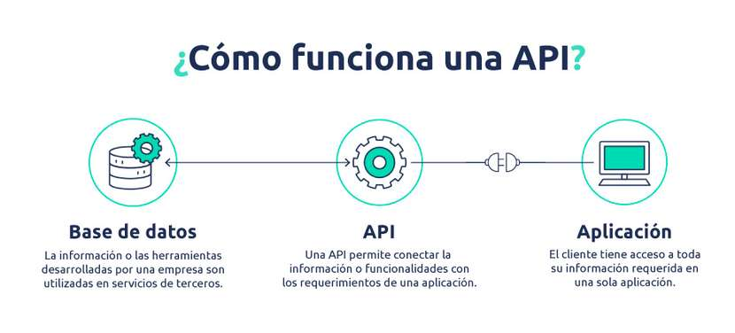

###Concepto de API

Las API son mecanismos que permiten a dos componentes de software comunicarse entre sí mediante un conjunto de definiciones y protocolos. Por ejemplo, el sistema de software del instituto de meteorología contiene datos meteorológicos diarios. La aplicación meteorológica de su teléfono “habla” con este sistema a través de las API y le muestra las actualizaciones meteorológicas diarias en su teléfono.

API significa “interfaz de programación de aplicaciones”. En el contexto de las API, la palabra **aplicación** se refiere a cualquier software con una función distinta. La **interfaz** puede considerarse como un contrato de servicio entre dos aplicaciones. Este contrato define cómo se comunican entre sí mediante solicitudes y respuestas. La documentación de su API contiene información sobre cómo los desarrolladores deben estructurar esas solicitudes y respuestas.

###Métodos en una API REST

El término **REST** (Representational State Transfer) se originó en el año 2000, descrito en la tesis de Roy Fielding, padre de la especificación HTTP. Un servicio REST no es una arquitectura software, sino un conjunto de restricciones que tener en cuenta en la arquitectura software que usaremos para crear aplicaciones web respetando HTTP.

Según Fielding las restricciones que definen a un sistema RESTful serían:

- **Cliente-servidor**: El servidor se encarga de controlar los datos mientras que el cliente se encarga de manejar las interacciones del usuario. Esta restricción mantiene al cliente y al servidor débilmente acoplados (el cliente no necesita conocer los detalles de implementación del servidor y el servidor se “despreocupa” de cómo son usados los datos que envía al cliente).
- **Sin estado**: Cada petición que recibe el servidor debería ser independiente y contener todo lo necesario para ser procesada.
- **Cacheable**: debe admitir un sistema de almacenamiento en caché. Este almacenamiento evitará repetir varias conexiones entre el servidor y el cliente para recuperar un mismo recurso.
- **Interfaz uniforme**: define una interfaz genérica para administrar cada interacción que se produzca entre el cliente y el servidor de manera uniforme, lo cual simplifica y separa la arquitectura. Esta restricción indica que cada recurso del servicio REST debe tener una única dirección o “URI”.
- **Sistema de capas**: el servidor puede disponer de varias capas para su implementación. Esto ayuda a mejorar la escalabilidad, el rendimiento y la seguridad.

*Las operaciones más importantes que nos permitirán manipular los recursos son:*

- **GET** es usado para recuperar un recurso.
- **POST** se usa la mayoría de las veces para crear un nuevo recurso. También puede usarse para enviar datos a un recurso que ya existe para su procesamiento. En este segundo caso, no se crearía ningún recurso nuevo.
- **PUT** es útil para crear o editar un recurso. En el cuerpo de la petición irá la representación completa del recurso. En caso de existir, se reemplaza, de lo contrario se crea el nuevo recurso.
- **PATCH** realiza actualizaciones parciales. En el cuerpo de la petición se incluirán los cambios a realizar en el recurso. Puede ser más eficiente en el uso de la red que PUT ya que no envía el recurso completo.
- **DELETE** se usa para eliminar un recurso.
  
Otras operaciones menos comunes pero también destacables son:

- **HEAD** funciona igual que GET pero no recupera el recurso. Se usa sobre todo para testear si existe el recurso antes de hacer la petición GET para obtenerlo (un ejemplo de su utilidad sería comprobar si existe un fichero o recurso de gran tamaño y saber la respuesta que obtendríamos de la API REST antes de proceder a la descarga del recurso).
- **OPTIONS** permite al cliente conocer las opciones o requerimientos asociados a un recurso antes de iniciar cualquier petición sobre el mismo.
Dos términos a tener en cuenta son los de métodos seguros y métodos idempotentes. Se dice que los métodos seguros son aquellos que no modifican recursos (serían GET, HEAD y OPTIONS), mientras que los métodos idempotentes serían aquellos que se pueden llamar varias veces obteniendo el mismo resultado (GET, PUT, DELETE, HEAD y OPTIONS).

La idempotencia es de mucha importancia ya que permite que la API sea tolerante a fallos. Por ejemplo, en una API REST bien diseñada podremos realizar una operación PUT para editar un recurso. En el caso de que obtuviésemos un fallo de Timeout (se ha superado el tiempo de espera de respuesta a la petición), no sabríamos si el recurso fue creado o actualizado. Como PUT es idempotente, no tenemos que preocuparnos de comprobar su estado ya que, en el caso de que se haya creado el recurso, una nueva petición PUT no crearía otro más, algo que sí habría podido pasar con una operación como POST.

###Glosario suplementario

####Cliente-Servidor

El **cliente** es la parte que solicita y consume servicios, mientras que el **servidor** es la parte que responde a esas solicitudes proporcionando los servicios o recursos requeridos. 

***Frontend (lado del cliente):***

El frontend es la parte de una aplicación o sistema que interactúa directamente con el usuario final. Normalmente, el frontend se ejecuta en el navegador web de un usuario o en una aplicación móvil en el dispositivo del usuario. *Su función principal es presentar la interfaz de usuario, recopilar la entrada del usuario (como formularios o clics) y mostrar la información al usuario*. El frontend puede utilizar tecnologías como HTML, CSS y JavaScript para crear la interfaz de usuario y gestionar la interacción del usuario. El frontend puede realizar solicitudes al backend (en el lado del servidor) para obtener datos o servicios, y luego mostrar esos datos al usuario.

***Backend (lado del servidor):***

El backend es la parte de la aplicación que reside en el servidor y se encarga de procesar solicitudes, realizar operaciones de lógica de negocio, acceder a bases de datos y proporcionar servicios y recursos al frontend. El backend suele exponer API (Interfaces de Programación de Aplicaciones) que permiten al frontend realizar solicitudes y recibir respuestas estructuradas. En el backend, se gestionan las operaciones de seguridad, autenticación, autorización y lógica empresarial compleja. Puede estar alojado en servidores físicos, en la nube o en una combinación de ambos, según las necesidades de la aplicación.

En resumen, el frontend y el backend trabajan juntos en una aplicación cliente-servidor. El frontend se ejecuta en el lado del cliente y se encarga de la interfaz de usuario y la interacción con el usuario, mientras que el backend se ejecuta en el lado del servidor y se encarga de la lógica empresarial, el acceso a datos y la gestión de servicios. La comunicación entre el frontend y el backend se realiza a través de solicitudes y respuestas a través de una red, generalmente utilizando protocolos como HTTP.

